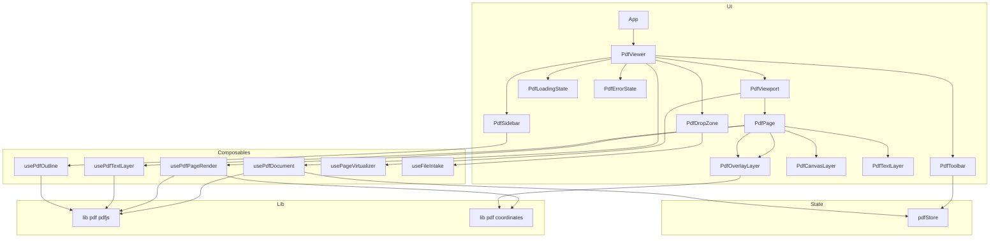
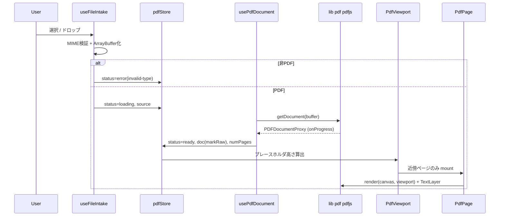
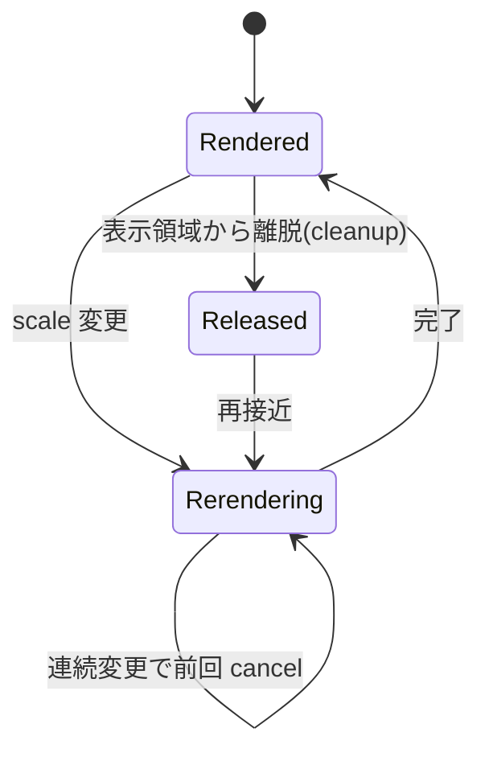
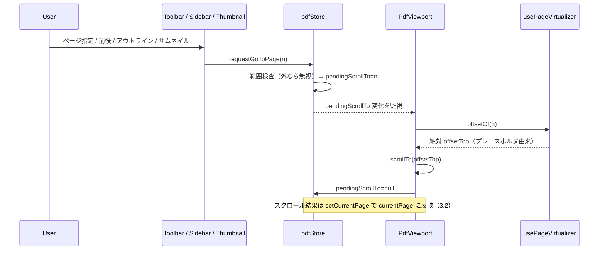

# Design Document — pdf-viewer

## Overview

**Purpose**: 本機能は、機密文書を外部へ送らずブラウザ内だけで閲覧したいユーザーへ、クライアント
サイド完結の PDF ビューア（フェーズ1）を提供する。
**Users**: 閲覧者はローカル PDF を開いて連続スクロール・ズーム・ナビゲーション・テキスト選択で
読む。開発者は将来の注釈・領域・グラフ機能を、座標整合したオーバーレイ拡張点へ接続する。
**Impact**: アプリコードが存在しない現状に対し、Vue 3 + Vite + TypeScript + Pinia + raw
`pdfjs-dist` の SPA を新設する。描画ループを自前所有し、座標系を制御することで将来機能を阻害しない。
外枠 UI（chrome）は **Vuetify 4** を用い、PDF 描画3層は素の DOM/canvas のままとする。

### Goals
- ローカル PDF を選択／D&D で開き、連続スクロールで鮮明に描画する（要件 1, 2）。
- ページ送り・ジャンプ・ズーム・フィット・テキスト選択・アウトライン/サムネイルを提供する（要件 3, 4, 5）。
- 大規模 PDF を仮想化で快適に扱い、ローディング/エラー状態を明示する（要件 6, 7）。
- 各ページに座標整合した空のオーバーレイ層を常設し、PDF単位⇄表示座標変換を提供する（要件 8）。

### Non-Goals
- マーカ／メモの保存・永続化、レイアウト解析（領域検出・OCR）、レイアウトのグラフ構造管理。
- サーバー連携・クラウド保存、PDF の編集・書き出し・印刷・全文検索。
- 認証・マルチユーザー。

## Boundary Commitments

### This Spec Owns
- PDF の読み込み（ArrayBuffer 化・MIME 検証）と描画ライフサイクル（ロード→描画→破棄）。
- ビュー状態（現在ページ・倍率・フィットモード・ステータス）と、その単一の真実源（Pinia ストア）。
- ページ描画スタック（キャンバス層・テキスト層・空オーバーレイ層）と PDF単位⇄表示座標の変換契約。
- pdfjs への唯一のアクセス境界（`src/lib/pdf/pdfjs.ts`）。

### Out of Boundary
- オーバーレイ層に表示する**内容**（注釈・領域・グラフ）。本spec は層と座標変換のみを提供する。
- 注釈/領域/グラフのデータモデル・永続化・解析処理。型と空ストアスライスを**予約**するに留める。
- サーバー、ルーティング、国際化、テーマ切替の作り込み。

### Allowed Dependencies
- `pdfjs-dist`（描画エンジン、唯一の境界モジュール経由）。
- Vue 3 / Pinia / Vite / Vitest（steering の tech.md 準拠）。
- `vuetify`（v4）/ `vite-plugin-vuetify` / `@mdi/font` — **chrome 専用**。描画3層には持ち込まない。
- ブラウザ標準 API（File, IntersectionObserver, ResizeObserver, devicePixelRatio）。
- 依存方向の制約: UI → composables → store → lib/pdf。逆流禁止。コンポーネントは pdfjs を直接 import しない。

### Revalidation Triggers
- `lib/pdf/coordinates.ts` の変換契約（PDF単位⇄表示座標）の形が変わる。
- `PdfOverlayLayer` のスロット契約（公開する viewport / 変換関数）が変わる。
- `pdfStore` の公開状態・予約スライス（`annotations` / `layoutRegions` / `layoutGraph`）の形が変わる。
- `pdfjs-dist` のメジャー更新（描画/テキスト層/ワーカー API の変更）。
- Vuetify が描画3層へ侵入する変更（chrome 専用境界の破り）。

## Architecture

### Architecture Pattern & Boundary Map

レイヤード構成。依存は左から右への一方向（**UI → composables → store → lib/pdf**）に限定する。



**Key Decisions**:
- 選択パターン: レイヤード + 単一 pdfjs 境界。pdfjs の差し替え・API 変更の影響を `lib/pdf` に閉じる。
- ページは3層スタック（同一原点）。オーバーレイ層はフェーズ1で空だが常設し、スロットで座標契約を公開。
- 状態は `pdfStore` に集約。重い `PDFDocumentProxy` は `markRaw` で保持しディープリアクティブ化しない。
- ページ単位の描画状態（RenderTask 等）はストアに置かず composables 内で保持する。

### Technology Stack

| Layer | Choice / Version | Role in Feature | Notes |
|-------|------------------|-----------------|-------|
| Frontend | Vue 3.5（`<script setup>` SFC） | UI・リアクティブ描画 | Router は不採用（単一画面） |
| Build | Vite（最新安定） + `vite-plugin-vuetify` | 開発/ビルド、ワーカーのアセット解決、Vuetify autoImport/treeshaking | `?url` import 必須、`{ autoImport: true }` |
| Language | TypeScript strict | 型安全（`any` 禁止） | |
| State | Pinia | ドキュメント/ビュー状態の単一真実源 | `markRaw` でpdfjs保持 |
| PDF Engine | `pdfjs-dist` v6 系（raw） | 描画・テキスト層・アウトライン | 単一 import 境界 |
| UI（chrome） | Vuetify 4 + `@mdi/font` | ツールバー/サイドバー/進捗/エラー/ダイアログ/テーマ | **描画3層には不使用** |
| Render layers | 素の DOM/canvas + scoped CSS | キャンバス/テキスト/オーバーレイの座標精度配置 | Vuetify を挟まない |
| Test | Vitest + @vue/test-utils + jsdom | ユニット/コンポーネント | canvas/worker はモック |

## File Structure Plan

### Directory Structure
```
.
├── index.html                       # エントリ HTML
├── package.json / vite.config.ts / tsconfig.json / vitest.config.ts  # ビルド・型・テスト設定（vite.config に vuetify プラグイン）
├── src/
│   ├── main.ts                      # Vue + Pinia + Vuetify 起動（app.use(vuetify)）
│   ├── App.vue                      # 薄いルート（<v-app> でラップし PdfViewer を載せる）
│   ├── plugins/
│   │   └── vuetify.ts               # createVuetify() + vuetify/styles + MDI CSS
│   ├── lib/pdf/
│   │   ├── pdfjs.ts                 # pdfjs を import する唯一のモジュール + worker 設定
│   │   └── coordinates.ts           # PDF単位 ⇄ 表示px 変換（純粋関数）
│   ├── composables/
│   │   ├── usePdfDocument.ts        # 読み込み・numPages・破棄（ストア連携）
│   │   ├── usePdfPageRender.ts      # DPR対応描画 + 前回RenderTaskキャンセル
│   │   ├── usePdfTextLayer.ts       # TextLayer 構築（選択可能テキスト）
│   │   ├── usePdfOutline.ts         # アウトライン取得・移動先解決
│   │   ├── usePageVirtualizer.ts    # プレースホルダ高さ確保 + 近傍描画 + cleanup
│   │   ├── useFileIntake.ts         # 選択/D&D → ArrayBuffer、MIME検証
│   │   └── useZoomShortcuts.ts      # ブラウザズーム上書き（Ctrl+/-/0・Ctrl+ホイール）→ PDF ズーム
│   ├── stores/
│   │   └── pdfStore.ts              # doc/view 状態 + 予約スライス
│   ├── components/
│   │   ├── PdfViewer.vue            # オーケストレータ
│   │   ├── PdfToolbar.vue           # 開く/ナビ/ズーム/フィット/ページ数
│   │   ├── PdfDropZone.vue          # 全面 D&D
│   │   ├── PdfSidebar.vue           # アウトライン + サムネイル
│   │   ├── PdfViewport.vue          # スクロール容器 + 仮想化ホスト
│   │   ├── PdfPage.vue              # 3層スタック
│   │   ├── PdfCanvasLayer.vue       # ラスタ描画
│   │   ├── PdfTextLayer.vue         # 選択可能テキスト層
│   │   ├── PdfOverlayLayer.vue      # 拡張点（スコープ付きスロット）
│   │   ├── PdfThumbnail.vue         # サムネイル1枚
│   │   ├── PdfLoadingState.vue      # ローディング/進捗/初期案内
│   │   └── PdfErrorState.vue        # 破損/パスワード/非PDF
│   ├── types/
│   │   ├── pdf.ts                   # ビュー/ステータス/ドキュメント型
│   │   └── overlay.ts              # 将来用 型スタブ（注釈/領域/グラフ）
│   └── styles/
│       ├── tokens.css               # CSS カスタムプロパティ
│       └── layers.css               # ページ3層の位置決め CSS
└── tests/                           # *.spec.ts（座標/ストア/受け入れ/スロット契約）
```

### Modified Files
- なし（新規プロジェクト）。

## System Flows

### 読み込み → 描画ライフサイクル


### ズーム時の再描画とキャンセル

描画は前回 `RenderTask` を `cancel()` してから開始し、`RenderingCancelledException` は握り潰す。
フィットモード時は ResizeObserver でコンテナ変化を検知し倍率を再計算する。

### ページジャンプ（仮想化下でも未描画ページへ着地）


## Requirements Traceability

| Requirement | Summary | Components | Interfaces | Flows |
|-------------|---------|------------|------------|-------|
| 1.1, 1.2, 1.4 | 開く（選択/D&D/非PDF拒否） | PdfDropZone, PdfToolbar, useFileIntake | `FileIntake` | 読み込みフロー |
| 1.3 | ドラッグ視覚FB | PdfDropZone | — | — |
| 1.5 | 非アップロード | useFileIntake, usePdfDocument | `FileIntake` | 読み込みフロー |
| 2.1 | 連続スクロール | PdfViewport, PdfPage | `Virtualizer` | 描画フロー |
| 2.2 | DPR鮮明描画 | PdfCanvasLayer, usePdfPageRender | `PageRender` | ズーム/再描画 |
| 2.3 | テキスト選択層 | PdfTextLayer, usePdfTextLayer | `TextLayer` | — |
| 2.4, 8.2, 8.3 | レイヤ座標整合 | PdfOverlayLayer, coordinates | `Coordinates`, `OverlaySlot` | ズーム/再描画 |
| 2.5 | ページの水平中央揃え | PdfViewport | プレースホルダ left 中央寄せ | — |
| 3.1, 3.2 | ページ番号/追従 | PdfToolbar, PdfViewport, pdfStore | `PdfState` | — |
| 3.6 | 未読込時 0/0 表示 | PdfToolbar | `PdfState` | — |
| 4.6 | ブラウザズーム上書き | useZoomShortcuts, PdfViewer, pdfStore | `PdfState` | — |
| 3.3, 3.4, 3.5 | 前後/ジャンプ/範囲外 | PdfToolbar, pdfStore, usePageVirtualizer | `PdfState` | — |
| 4.1, 4.2 | ズーム/クランプ | PdfToolbar, pdfStore, usePdfPageRender | `PdfState`, `PageRender` | ズーム/再描画 |
| 4.3, 4.4, 4.5 | フィット/リサイズ | PdfViewport, pdfStore | `PdfState` | ズーム/再描画 |
| 5.1, 5.2, 5.5 | アウトライン（5.5=未取得時タブ非表示） | PdfSidebar, usePdfOutline | `Outline` | — |
| 5.9 | ドロワーのスライド表示・順序 | PdfSidebar | `PdfState` | — |
| 5.3, 5.4 | サムネイル | PdfSidebar, PdfThumbnail | `Virtualizer` | — |
| 5.6 | ナビ領域と本文の独立スクロール | PdfViewer, PdfDropZone, PdfViewport | アプリシェル高さ規約 | — |
| 5.7 | 現在ページのアウトライン強調 | PdfSidebar, pdfStore | `PdfState` | — |
| 5.8 | 強調行のアウトライン自動スクロール | PdfSidebar | `PdfState` | — |
| 6.1, 6.3, 6.4 | 仮想化/解放 | PdfViewport, usePageVirtualizer | `Virtualizer` | 描画フロー |
| 6.2 | 正しいスクロール総量 | PdfViewport, usePageVirtualizer | `Virtualizer` | — |
| 7.1, 7.2 | ローディング/進捗 | PdfLoadingState, usePdfDocument | `PdfState` | 読み込みフロー |
| 7.3, 7.4 | 破損/パスワード | PdfErrorState, usePdfDocument | `PdfError` | 読み込みフロー |
| 7.5 | 初期案内 | PdfLoadingState | `PdfState` | — |
| 8.1, 8.4 | 空オーバーレイ常設 | PdfPage, PdfOverlayLayer | `OverlaySlot` | — |

## Components and Interfaces

| Component | Domain/Layer | Intent | Req Coverage | Key Dependencies (P0/P1) | Contracts |
|-----------|--------------|--------|--------------|--------------------------|-----------|
| pdfStore | State | doc/view 状態の単一真実源 | 1,2,3,4,7 | pdfjs boundary (P1) | State |
| usePdfDocument | Composable | 読み込み/破棄、ストア更新 | 1,2,7 | pdfjs (P0), pdfStore (P0) | Service |
| usePdfPageRender | Composable | DPR描画+キャンセル | 2,4 | pdfjs (P0), coordinates (P1) | Service |
| usePdfTextLayer | Composable | テキスト層構築 | 2 | pdfjs (P0) | Service |
| usePdfOutline | Composable | アウトライン取得/解決 | 5 | pdfjs (P0) | Service |
| usePageVirtualizer | Composable | 仮想化/高さ確保/解放 | 2,3,6 | pdfStore (P1) | Service |
| useFileIntake | Composable | 受け入れ/MIME検証 | 1 | — | Service |
| coordinates | Lib | PDF単位⇄表示px 変換 | 2,8 | pdfjs viewport (P1) | Service |
| PdfOverlayLayer | UI | 空の拡張点 + スロット契約 | 8 | coordinates (P1) | State |
| PdfViewer/Toolbar/Sidebar/Thumbnail/DropZone/Loading/Error | UI(chrome) | 表示・操作 | 1,3,4,5,7 | 上記 composables, Vuetify (P1) | — |
| PdfViewport/Page/CanvasLayer/TextLayer | UI(render) | 描画3層・スクロール | 2,3,6 | 上記 composables（Vuetify不使用） | — |

### Lib

#### coordinates
| Field | Detail |
|-------|--------|
| Intent | PDF文書座標（左下原点・無倍率）と表示レイヤ座標（左上原点・倍率/DPR反映）の相互変換 |
| Requirements | 2.4, 8.2, 8.3 |

**Responsibilities & Constraints**
- pdfjs `PageViewport` の `convertToViewportPoint` / `convertToPdfPoint` を薄くラップし、純粋関数化。
- 倍率と軸反転を内包。永続データは PDF 単位で持ち、表示時に再射影（ズーム不変）。

**Contracts**: Service [x]

##### Service Interface
```typescript
import type { PageViewport } from 'pdfjs-dist'

export interface PdfPoint { x: number; y: number }        // PDF 単位（左下原点）
export interface LayerPoint { left: number; top: number } // 表示レイヤ px（左上原点）
export interface PdfRect { x: number; y: number; width: number; height: number }

export function toLayerPoint(vp: PageViewport, p: PdfPoint): LayerPoint
export function toPdfPoint(vp: PageViewport, p: LayerPoint): PdfPoint
export function toLayerRect(vp: PageViewport, r: PdfRect): { left: number; top: number; width: number; height: number }
```
- Preconditions: `vp` は対象ページ・対象倍率の viewport。
- Postconditions: `toPdfPoint(vp, toLayerPoint(vp, p)) ≈ p`（往復恒等、浮動小数誤差内）。
- Invariants: 倍率変更は `vp` 差し替えで吸収し、PDF 単位値は不変。

### State

#### pdfStore
| Field | Detail |
|-------|--------|
| Intent | ドキュメント/ビュー状態の単一真実源。重い pdfjs オブジェクトは markRaw 保持 |
| Requirements | 1.x, 2.1, 3.x, 4.x, 7.x |

**Contracts**: State [x]

##### State Management
```typescript
import type { PDFDocumentProxy } from 'pdfjs-dist'
import type { Annotation, LayoutRegion, LayoutGraph } from '@/types/overlay'

export type PdfStatus = 'idle' | 'loading' | 'ready' | 'error'
export type FitMode = 'none' | 'width' | 'page'
export type PdfErrorKind = 'invalid-type' | 'corrupt' | 'password' | 'unknown'
export interface PdfError { kind: PdfErrorKind; message: string }

export interface PdfState {
  source: ArrayBuffer | null
  doc: PDFDocumentProxy | null   // markRaw 保持
  numPages: number
  currentPage: number            // 1-origin（スクロール追従の結果）
  pendingScrollTo: number | null // ジャンプ要求（PdfViewport が消費しスクロール後 null 化）
  scale: number                  // 描画倍率
  fitMode: FitMode
  loadProgress: number | null    // 0..1
  status: PdfStatus
  error: PdfError | null
  // 予約（フェーズ1未使用・型のみ。ページ番号キー）
  annotations: Record<number, Annotation[]>
  layoutRegions: Record<number, LayoutRegion[]>
  layoutGraph: LayoutGraph | null
}
```
- Actions（契約）: `load(source)`, `setReady(doc, numPages)`, `setError(error)`, `reset()`,
  `requestGoToPage(n)`（範囲外は無視＝現状維持: 要件 3.5。ジャンプ要求として `pendingScrollTo` に
  セット）, `zoomIn()/zoomOut()`（`SCALE_MIN..SCALE_MAX` にクランプ: 要件 4.2）, `setFitMode(mode)`,
  `setScale(n)`, `setCurrentPage(n)`（スクロール由来の現在ページ反映: 要件 3.2）。
- **ジャンプ結線（Issue 2 反映）**: `currentPage`（=スクロール追従の結果）と `pendingScrollTo`
  （=ユーザーのジャンプ要求）を分離する。ツールバーのページ指定・前後、アウトライン項目選択
  （3.4, 5.2）、サムネイル選択（5.4）はすべて `requestGoToPage(n)` を呼び、`PdfViewport` が
  `pendingScrollTo` を監視して `usePageVirtualizer.offsetOf(n)` の絶対位置へスクロール後にクリアする。
  未描画ページでも `offsetOf` がプレースホルダから絶対位置を返すため正しく着地する。
- 状態遷移: `idle → loading → ready | error`、`reset()` で `idle`。
- Persistence: なし（クライアント内メモリのみ。要件 1.5）。

**Implementation Notes**
- Integration: composables から actions 経由でのみ更新。
- Risks: `doc` を markRaw 忘れると性能劣化 → 規約・レビューで担保。

### Composables（Service 契約サマリ）

#### usePdfDocument — Req 1.x, 2.x, 7.x
```typescript
export interface UsePdfDocument {
  open(source: ArrayBuffer): Promise<void>   // loading→ready/error、onProgress を loadProgress へ
  close(): void                              // doc.destroy() + store.reset()
}
```
- エラー写像: pdfjs `PasswordException → password`、`InvalidPDFException → corrupt`、他 `unknown`。
- 破棄: アンマウント時 `loadingTask.destroy()`/`doc.destroy()` を保証。

#### usePdfPageRender — Req 2.2, 4.1
```typescript
export interface UsePdfPageRender {
  render(canvas: HTMLCanvasElement, page: PDFPageProxy, scale: number): Promise<void>
  cancel(): void
}
```
- DPR: バッキングストアを `devicePixelRatio` 倍、CSS ボックスは `viewport.width/height`。
- キャンセル: 新規 render 前に前回 `RenderTask.cancel()`、`RenderingCancelledException` を握り潰す。

#### usePdfTextLayer — Req 2.3
```typescript
export interface UsePdfTextLayer {
  render(container: HTMLElement, page: PDFPageProxy, viewport: PageViewport): Promise<void>
}
```
- `TextLayer` クラスで構築。テキスト層は canvas と同一原点・同寸。

#### usePdfOutline — Req 5.1, 5.2, 5.5
```typescript
export interface OutlineNode { title: string; pageIndex: number | null; children: OutlineNode[] }
export interface UsePdfOutline {
  load(doc: PDFDocumentProxy): Promise<OutlineNode[]>  // 無い場合は空配列
  resolveDest(dest: unknown, doc: PDFDocumentProxy): Promise<number | null> // 1-origin ページ番号
}
```

#### usePageVirtualizer — Req 2.1, 3.x, 4.x, 6.x
```typescript
export interface PageDimension { pageNumber: number; widthPdf: number; heightPdf: number; rotation: number }
export interface PagePlaceholder { pageNumber: number; width: number; height: number; offsetTop: number }
export interface UsePageVirtualizer {
  placeholders: Readonly<Ref<PagePlaceholder[]>>  // 全ページ分の寸法事前確保（6.2）
  visiblePages: Readonly<Ref<number[]>>           // 近傍±Nのみ描画（6.1, 6.3）
  observe(pageEl: Element, pageNumber: number): void
  releaseFar(): void                              // 遠方ページ cleanup（6.4）
  activePage: Readonly<Ref<number>>               // スクロール追従（3.2）
  offsetOf(pageNumber: number): number            // ジャンプ先の絶対 offsetTop（3.4, 5.2, 5.4）
  recompute(scale: number): void                  // scale/fit/リサイズ変更で再計算（4.x, 6.2）
}
```

**ページサイズ不均一とフィットの扱い（Issue 1 反映）**:
- 各ページは固有の寸法・回転を持つ（`PageDimension`、読み込み後に各 `PDFPageProxy` から取得）。
  プレースホルダ高さは「**当該ページの viewport 寸法 × 現在 `scale`**」で個別算出し、全ページ合算で
  正しいスクロール総量を得る（6.2）。
- **フィット基準はコンテナ幅基準に統一**: `fitMode='width'` は「最も広いページがコンテナ幅に収まる」
  単一 `scale` を採用（全ページで横スクロールが出ない一貫表示）。`fitMode='page'` は「最も広い／高い
  ページが表示領域に収まる」`scale`。これにより全ページ共通の単一 `scale` で破綻しない。
- `scale` / `fitMode` 変更・コンテナリサイズ時は `recompute(scale)` で全プレースホルダを再算出
  （4.1, 4.3, 4.4, 4.5, 6.2）。IntersectionObserver は ±1ビューポートのルートマージン。

#### useFileIntake — Req 1.1, 1.2, 1.4
```typescript
export type FileIntakeResult =
  | { ok: true; buffer: ArrayBuffer }
  | { ok: false; kind: 'invalid-type' }
export interface UseFileIntake {
  fromInput(files: FileList | null): Promise<FileIntakeResult>
  fromDrop(event: DragEvent): Promise<FileIntakeResult>
}
```
- 検証: MIME `application/pdf` または拡張子 `.pdf`。失敗時 `invalid-type`。

### UI

#### PdfOverlayLayer（拡張点・要件 8）
| Field | Detail |
|-------|--------|
| Intent | キャンバス/テキスト層と同一原点に重なる空の層。座標契約をスロットで公開 |
| Requirements | 8.1, 8.2, 8.3, 8.4 |

**Contracts**: State [x]（スロット契約）

```typescript
// Props
export interface PdfOverlayLayerProps { viewport: PageViewport }
// スコープ付きスロットで公開する契約（フェーズ1では子なし）
export interface PdfOverlaySlotProps {
  viewport: PageViewport
  toLayer: (p: PdfPoint) => LayerPoint
  toPdf: (p: LayerPoint) => PdfPoint
  toLayerRect: (r: PdfRect) => { left: number; top: number; width: number; height: number }
}
```
- 層の寸法は `viewport.width/height`（px）に一致。フェーズ1は内容を描かない（8.4）。

#### その他 UI（サマリ）

**UI レイヤ分類（重要な境界）**:
- **chrome（Vuetify 使用）**: PdfToolbar, PdfSidebar, PdfThumbnail, PdfLoadingState, PdfErrorState,
  PdfDropZone のドラッグ視覚FB、将来のダイアログ。Material 部品（`VToolbar`/`VBtn`/`VTextField`/
  `VBtnToggle`/`VTooltip`/`VNavigationDrawer`/`VList`/`VTreeview`/`VProgressLinear`/`VAlert` 等）を用いる。
- **render（Vuetify 不使用・素の DOM/canvas）**: PdfViewport, PdfPage, PdfCanvasLayer, PdfTextLayer,
  PdfOverlayLayer。viewport 座標での精密配置のため Vuetify を挟まない。

- **PdfViewer**: 全体オーケストレーション。status に応じて Loading/Error/Viewport を出し分け。`<v-app>` 配下。
  **アプリシェルの高さ規約（要件 5.6）**: ルート（v-layout）を**固定高 `100vh` の definite な
  高さアンカー**にし、v-main → DropZone → PdfViewport を `height:100%` 連鎖で bounded 高にする
  （v-main は `overflow:hidden` で超過をウィンドウへ抜けさせない）。これにより `PdfViewport` の
  `overflow:auto` が**内部スクロールを所有**し、ウィンドウ/レイアウト側へスクロールが抜けない。
  結果としてサイドバー（独自に `overflow-y:auto` を持つドロワーペイン）と本文は**独立して
  スクロール**する（一方が他方を動かさない）。
  **ブラウザズーム上書き（要件 4.6）**: composable `useZoomShortcuts` を配線し、`window` の
  `keydown`（Ctrl/⌘ + `=`/`+`→zoomIn, `-`→zoomOut, `0`→100%）と `wheel`（`{ passive: false }`,
  Ctrl/⌘ + deltaY）を `preventDefault` で奪って `store.zoomIn/zoomOut/setScale` に割り当てる。
  `status === 'ready'` のときのみ作動し、未読込時はブラウザ既定ズームを残す。アンマウントで解除。
  注: Ctrl+ホイールは `{ passive:false }` で確実に抑止できるが、キーボードのズーム抑止はブラウザ依存。
- **PdfToolbar**: 開く・前後・ジャンプ・ズーム・フィット・ページ数。Vuetify 部品で構成し、操作は store actions/emit のみ（ロジックを持たない）。**未読込時のページ表示（要件 3.6）**: `numPages === 0` のとき現在ページ表示を `0` とし、総数 `0` と合わせて「0 / 0」にする。
- **PdfDropZone**: 全面 D&D。ドラッグ中の視覚FB は `VOverlay` 等（1.3）。`height:100%` 連鎖で子（Viewport/状態表示）へ bounded 高を渡す。
- **PdfSidebar / PdfThumbnail**: `VNavigationDrawer` + アウトライン木 / 仮想スクロール（サムネイル一覧）。選択で `goToPage`。
  **現在ページ強調（要件 5.7）**: `store.currentPage` を読み、強調対象のアウトライン項目＝
  「`pageIndex`（1-origin、非 null）が `currentPage` 以下で最大のノード」＝現在ページを含むしおりを
  `is-current` で視覚強調する。
  **自動スクロール追従（要件 5.8）**: 強調変化時、`nextTick` 後にドロワー内の最後の `is-current`
  要素へ `scrollIntoView({ block: 'nearest' })` し、強調行を可視に保つ。スクロールは
  `.pdf-sidebar-pane`（`overflow-y:auto`）内に閉じ、本文表示は動かさない（5.6 の独立スクロール前提）。
  **アウトライン未取得時のタブ制御（要件 5.5・改訂）**: `outlineLoaded && tree.length === 0` のとき
  アウトラインのタブ／ペインを `v-if` で非表示にし、サムネイルのみ表示。既定タブも `thumbnails` に
  切り替える（「アウトラインがありません」メッセージは廃止）。
  **ドロワーのスライド表示と順序（要件 5.9）**: ドロワーは `permanent` ではなく `v-model="drawerOpen"`
  のレイアウトドロワー（`temporary` を付けずスライド遷移）。`drawerOpen` 初期 `false`。`reloadOutline()`
  でアウトライン読込が完了した後に `nextTick` を挟んで `true` にしてスライドイン。PDF（PdfViewport）は
  `status==='ready'` で即マウントされるため、本文表示が先・ドロワー出現が後になる。doc 切替時は
  読込開始で `false`（閉）→ 完了で `true`（開）。
- **PdfViewport / PdfPage / PdfCanvasLayer / PdfTextLayer**: スクロール容器と3層スタック（素の DOM/canvas）。`.pdf-viewport` は bounded 高 + `overflow:auto` で内部スクロールを所有（要件 5.6）。
  **水平中央揃え（要件 2.5）**: 各ページプレースホルダは絶対配置で `left: max(0px, calc(50% - 幅/2))` とし、ページ幅が表示領域より狭いときは左右余白を均等に中央寄せ、広いとき（ズームイン）は `0` に張り付き従来どおり水平スクロールする。純CSSのためコンテナ幅にリアクティブ。
- **PdfLoadingState / PdfErrorState**: `VProgressLinear`/`VProgressCircular`/`VAlert`/`VEmptyState` で進捗・初期案内・破損/パスワード/非PDF を表示。

## Data Models

クライアント内の一時状態のみで永続化はない。`types/overlay.ts` は**将来用の予約**（フェーズ1で実装しない）。

```typescript
// types/overlay.ts — 予約スタブ（座標は PDF 単位で保持する方針のみ確定）
export interface Annotation { id: string; page: number; rect: PdfRect; kind: string; note?: string }
export interface LayoutRegion { id: string; page: number; rect: PdfRect; label: string }
export interface LayoutGraphNode { id: string; region: LayoutRegion }
export interface LayoutGraphEdge { from: string; to: string; relation: string }
export interface LayoutGraph { nodes: LayoutGraphNode[]; edges: LayoutGraphEdge[] }
```

## Error Handling

### Error Strategy
読み込み境界（useFileIntake / usePdfDocument）で早期に分類し、`pdfStore.error` へ写像、`PdfErrorState`
が利用者向けメッセージを表示する。描画キャンセルはエラーではなく正常系として握り潰す。

### Error Categories and Responses
- **User Errors**: 非PDF（`invalid-type`）→ 形式エラー表示し読み込み中止（1.4）。
- **Content Errors**: 破損（`corrupt`）/ パスワード保護（`password`）→ 理由を明示（7.3, 7.4）。
- **Unexpected**: その他例外 → `unknown` として一般メッセージ + 再選択導線。
- **Non-error**: `RenderingCancelledException` → 握り潰す（ズーム連打/離脱時）。

### Monitoring
フェーズ1はクライアント単体のため `console.error` 程度。外部送信は行わない（1.5）。

## Testing Strategy

### Unit Tests（jsdom、canvas/worker 不要）
- `coordinates`: `toPdfPoint(vp, toLayerPoint(vp, p)) ≈ p`（往復恒等）、軸反転、倍率/DPR 整合（2.4, 8.2）。
- `pdfStore`: `zoomIn/zoomOut` のクランプ（4.2）、`goToPage` 範囲外無視（3.5）、`fitMode` 遷移、
  status 状態機械 `idle→loading→ready|error`（7.x）。
- `useFileIntake`: MIME/拡張子検証と `invalid-type` 判定（1.4）。
- `usePdfDocument` のエラー写像: Password/Invalid → `password`/`corrupt`（7.3, 7.4）。

### Component Tests（@vue/test-utils、`lib/pdf/pdfjs.ts` をモック）
- chrome コンポーネントのテストは Vuetify プラグインを `global.plugins` に登録して mount する。
- `PdfToolbar`: ズーム/ナビ操作で正しい action/emit、境界で無効化（3, 4）。
- `PdfViewer`: status に応じた Loading/Error/Viewport の出し分け（7）。
- `PdfOverlayLayer`: **スロット契約のロック** — viewport と `toLayer/toPdf/toLayerRect` がスロットへ
  渡り、層の寸法が `viewport.width/height` に一致（8.1, 8.2, 8.3）。

### E2E / 手動スモーク（将来は Playwright）
- 複数ページ PDF を選択/D&D で開く → 連続スクロール描画、ページ追従、前後/ジャンプ。
- ズーム/フィットで鮮明再描画、連打でちらつかない（キャンセル動作）。
- テキスト選択、アウトライン/サムネイル移動、大規模 PDF の応答性、破損/非PDF/パスワードの各表示。

## Performance & Scalability
- 仮想化で同時描画ページ数を抑制、遠方は `page.cleanup()`（6.x）。
- 描画はズーム変更時に前回タスクをキャンセルし無駄な描画を避ける（4.1）。
- 全ページのプレースホルダ高さ事前確保でスクロール総量を正確化（6.2）。

## Security Considerations
- PDF はクライアント内のみで処理し外部送信しない（要件 1.5）。ネットワーク呼び出しを行わない。
- ワーカーは CDN 固定せず、インストール済み `pdfjs-dist` とバージョン一致させる（`?url` 解決）。
